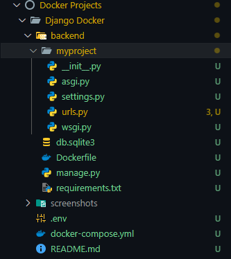
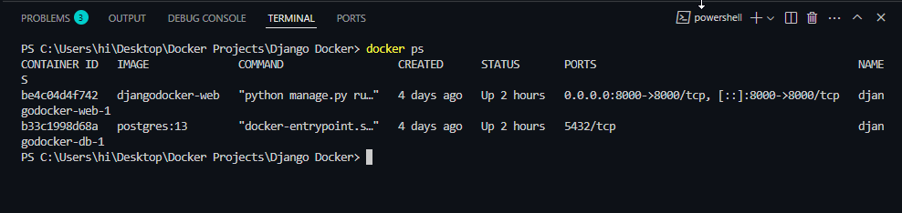
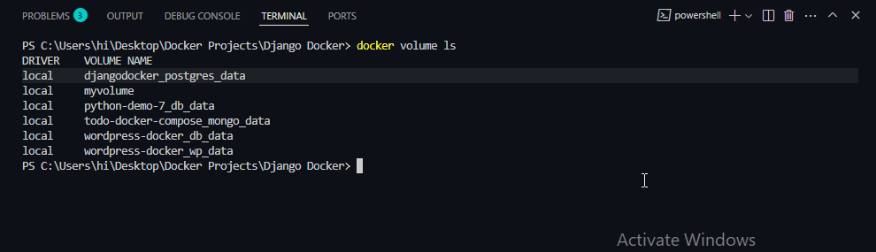
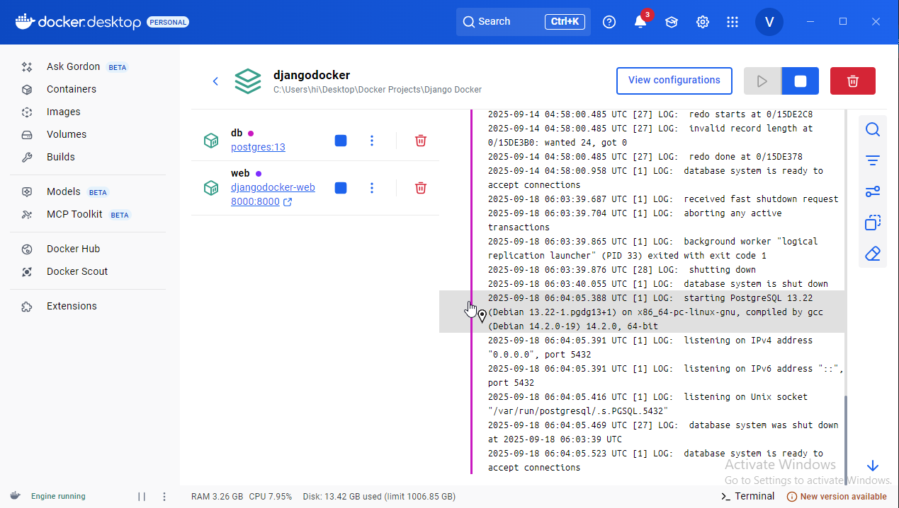
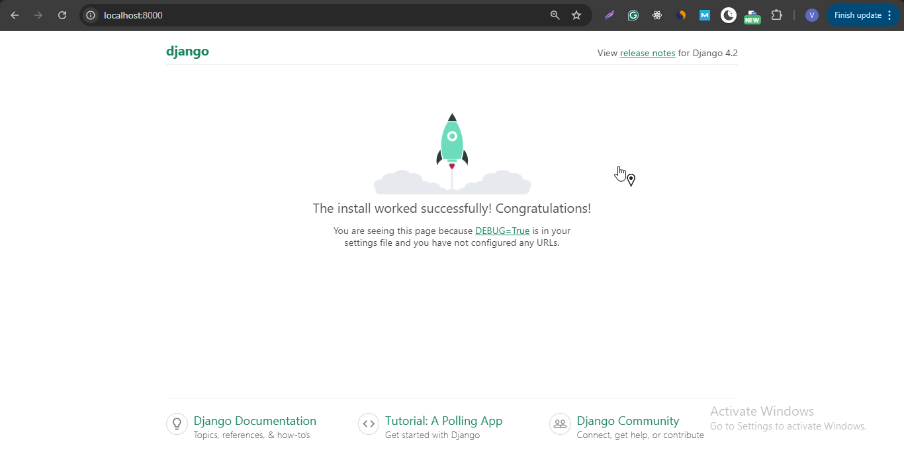
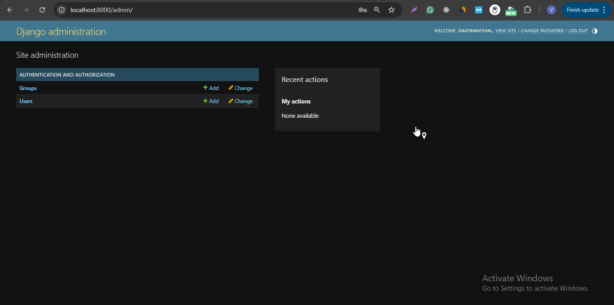

# 🐍 Django App with Docker Compose

This is a **Django application** with **PostgreSQL database** running inside Docker containers.  
The project is fully containerized using **Docker Compose** for easy setup and deployment.

---

## 🚀 Features
- Django web application with admin panel
- PostgreSQL database with persistent storage
- Environment variables stored in `.env`
- Fully containerized with Docker & Docker Compose
- Easy one-command setup

---

## 🛠️ Tech Stack
- **Backend:** Django (Python)  
- **Database:** PostgreSQL  
- **Containerization:** Docker & Docker Compose  

---

## 📸 Screenshots

### 1. Project File Structure


### 2. Running Containers


### 3. Docker Volumes


### 4. Docker Desktop


### 5. Django Homepage


### 6. Django Admin Panel


---

## 🛠️ Setup Instructions

1. Clone the repository:
   ```bash
   git clone https://github.com/gautamvishal1129-glitch/docker-projects.git
   cd django-docker
2️⃣ Copy .env.example → .env and update values if needed

cp .env.example .env


3️⃣ Build and run containers
docker compose up -d --build


4️⃣ Apply migrations
docker compose exec web python manage.py migrate

5️⃣ Create superuser
docker compose exec web python manage.py createsuperuser

6️⃣ Access the app

Django App 👉 http://localhost:8000

Admin Panel 👉 http://localhost:8000/admin

🔧 Useful Commands

Stop containers:

    docker compose down


View logs:

    docker compose logs -f


List volumes:

    docker volume ls

    
💾 Data Persistence

Data is stored in Docker volumes:

postgres_data → PostgreSQL database