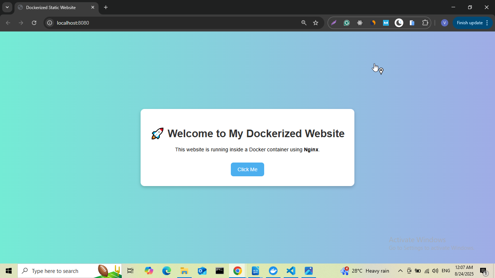
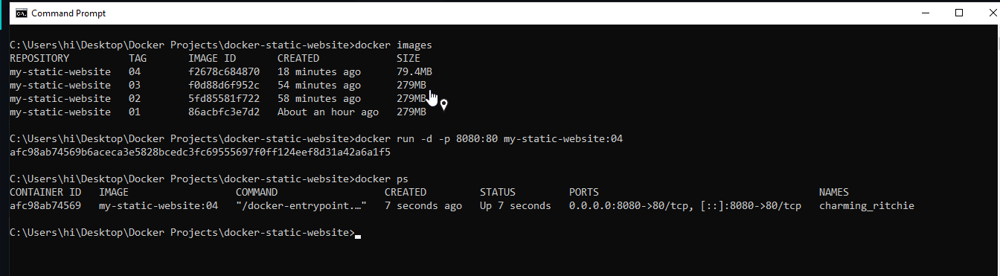

# Docker Static Website

This project is a static website deployed using Docker and Nginx.

## 🚀 Features
- Static website with HTML, CSS, and JS
- Dockerized using Nginx
- Portable and lightweight

## 🛠️ Technologies Used
- HTML, CSS, JavaScript
- Docker
- Nginx

## 📂 Project Structure
.
├── images/             # Screenshots for README
│   ├── browser.png
│   ├── docker.png
│   └── terminal.png
├── public/             # Website source files
│   ├── index.html
│   ├── style.css
│   └── script.js
├── Dockerfile          # Docker configuration
├── .dockerignore       # Files ignored by Docker
└── README.md           # Project documentation

## 🖥️ Screenshots

### Browser View


### Docker Desktop


### Terminal / Command Prompt



## 🏗️ How to Build and Run

# Clone the full monorepo
```bash

git clone https://github.com/gautamvishal1129-glitch/docker-projects.git

# Move into the specific project folder
cd docker-projects/docker-project-01

# build
docker build -t my-static-website:01 .

# run container
docker run -d -p 8080:80 my-static-website:01

# Access the website
Open your browser and go to http://localhost:8080


# stop the container
docker ps        # Find the container ID
docker stop <container_id>
