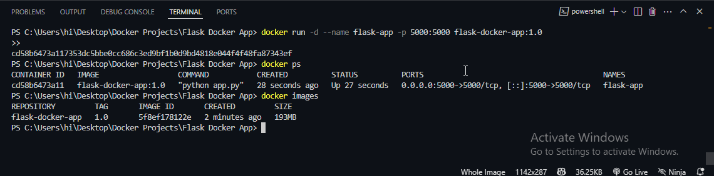

# Dockerized Python Flask Application

A minimal Flask app running inside Docker. Visit `http://localhost:5000` to see the message **"Hello from Docker Flask App!"**.

## Tech Stack
- Python 3.11 (slim)
- Flask 2.3
- Docker

## Project Structure

flask-docker-app/
├── screenshots/           # Screenshots for README
│   ├── browser.png
│   ├── docker.png
│   ├── terminal1.png
│   └── terminal2.png
├── app.py
├── requirements.txt
├── Dockerfile
├── .dockerignore
├── .gitignore
└── README.md

## 🖥️ Screenshots

### Browser View


### Docker Desktop


### Terminal / Command Prompt




## 🏗️ How to Build and Run

# Clone the full monorepo

```bash

git clone https://github.com/gautamvishal1129-glitch/docker-projects.git

# Move into the specific project folder
cd docker-projects/Flask Docker App

# build
docker build -t flask-docker-app:01 .

# run container
docker run -d --name flask-app -p 5000:5000 flask-docker-app:1.0

# Access the website
Open your browser and go to http://localhost:5000


# stop the container
docker ps        # Find the container ID
docker stop <container_id>
```


