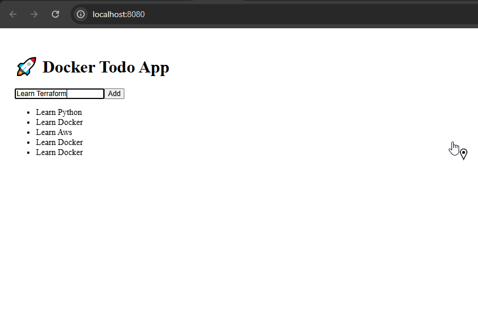
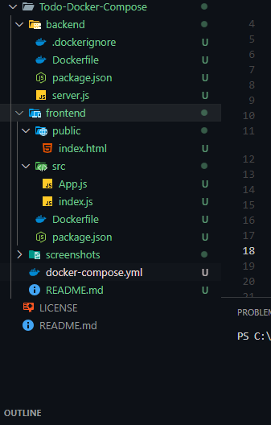
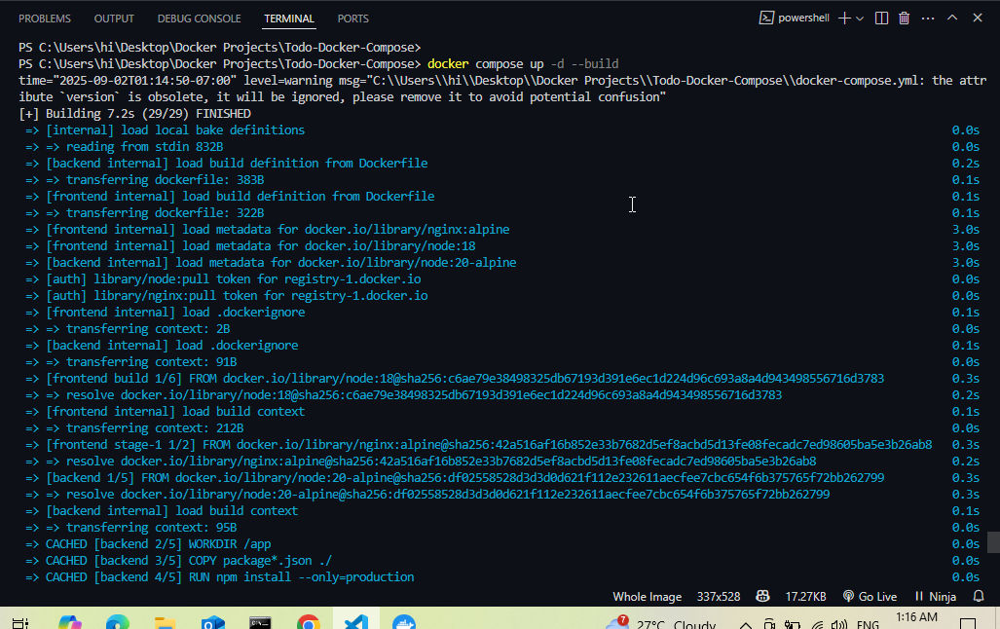
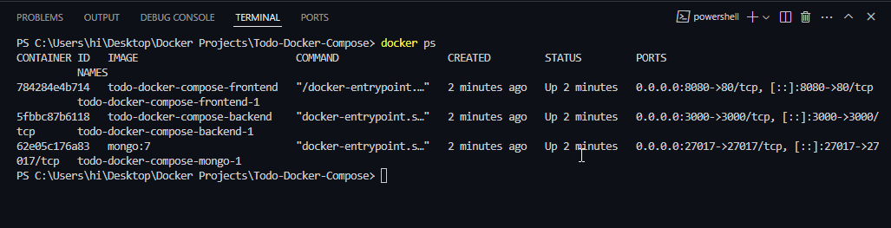
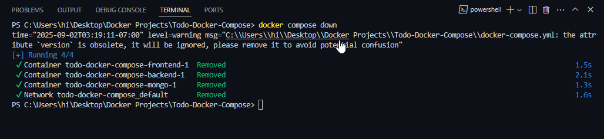
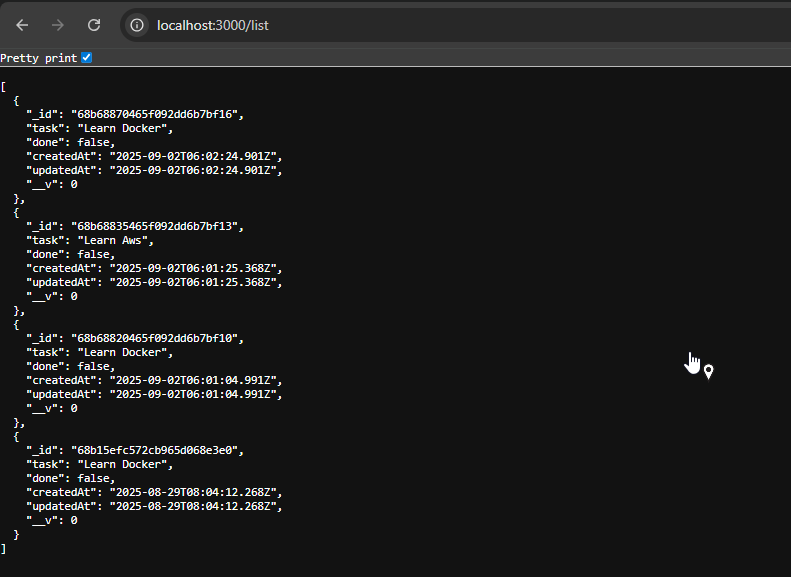

# 📝 Todo App with Docker Compose

This is a **full-stack Todo application** built with **React (Frontend)**, **Node.js + Express (Backend)**, and **MongoDB (Database)**.  
The entire project is containerized using **Docker Compose** for easy setup and deployment.

---

## 🚀 Features
- Add, view todos
- Persistent data stored in MongoDB
- Fully containerized with Docker
- Easy one-command setup using Docker Compose

---

## 🛠️ Tech Stack
- **Frontend:** React.js  
- **Backend:** Node.js, Express.js  
- **Database:** MongoDB  
- **Containerization:** Docker & Docker Compose  

---


## 🖥️ Screenshots

### Browser View



### Project Structure



### Terminal / Docker Running



### Terminal / Docker Container list




### Terminal / Docker Stop




### Backend Api Browser View




## 🏗️ How to Build and Run

# Clone the full monorepo

```bash

git clone https://github.com/gautamvishal1129-glitch/docker-projects.git

# Move into the specific project folder
cd docker-projects/Todo-Docker-Compose

# build
docker compose up -d --build


Access the Application

Frontend (React): 👉 http://localhost:8080

Backend (Express API): 👉 http://localhost:3000

MongoDB: running on localhost:27017