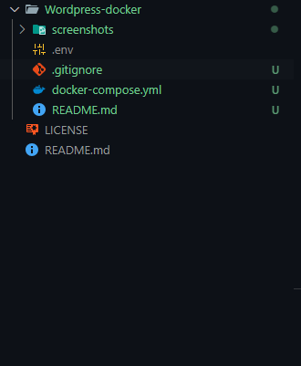
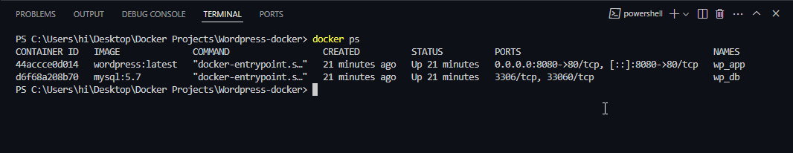
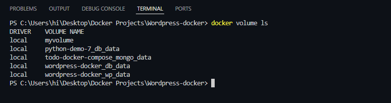
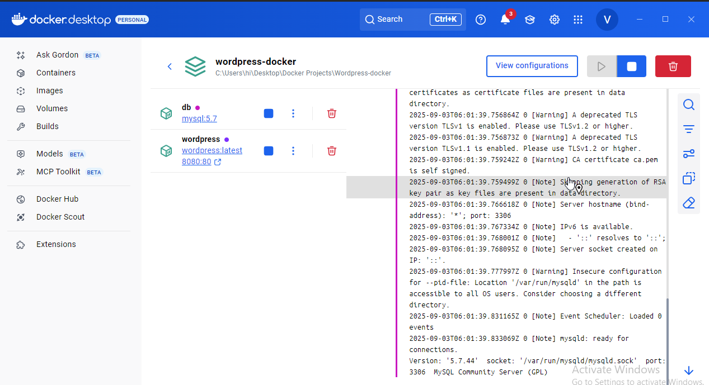
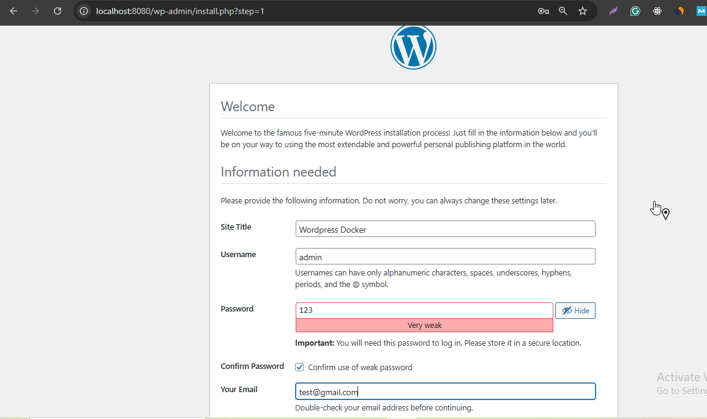
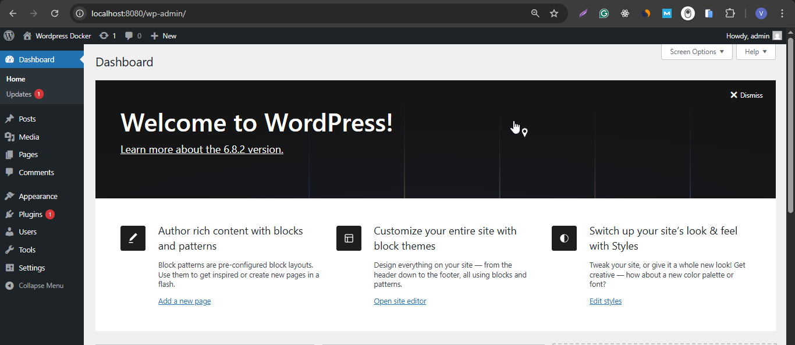
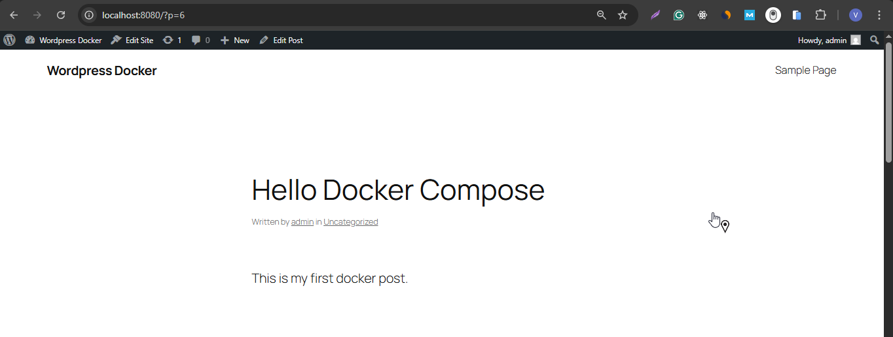

# WordPress Docker Project 🐳

This project runs **WordPress + MySQL** using Docker Compose.  
It uses volumes for **persistent storage**, so your data survives container restarts.

## 🚀 Features
- WordPress + MySQL with persistence
- Environment variables stored in `.env`
- Healthchecks for service readiness
- Easy setup with `docker compose up`

## 📸 Screenshots

### 1. Project File Structure


### 2. Running Containers


### 3. Docker Volumes


### 4. Docker Desktop


### 5. WordPress Installation


### 6. WordPress Dashboard


### 7. WordPress Post Example



---

## 🛠️ Setup Instructions

1. Clone the repository:
   ```bash
   git clone https://github.com/gautamvishal1129-glitch/docker-projects.git
   cd wordpress-docker

2. Copy .env.example to .env and update values if needed:
 
    cp .env.example .env

3. Start the project:

    docker compose up -d

4. Open your browser:

    http://localhost:8080
    
🔧 Useful Commands

Stop containers:

docker compose down


View logs:

docker compose logs -f


List volumes:

docker volume ls


💾 Data Persistence

Data is stored in Docker volumes:

db_data → MySQL database

wp_data → WordPress files
