🛠️ Microservices App with Docker Compose

This is a microservices-based application with Node.js (User Service), Python Flask (Product Service), MongoDB, and Redis running inside Docker containers.
The project is fully containerized using Docker Compose for easy setup and deployment.

🚀 Features

* User Service (Node.js): Signup/Login with MongoDB & Redis session management

* Product Service (Flask): Add & list products stored in MongoDB

* MongoDB database with persistent storage

* Redis cache for session handling

* Environment variables stored in .env

* Fully containerized with Docker & Docker Compose

* Easy one-command setup

🛠️ Tech Stack

* Backend: Node.js (User Service), Python Flask (Product Service)

* Database: MongoDB

* Cache: Redis

* Containerization: Docker & Docker Compose

## 📸 Screenshots

### 1. Project File Structure
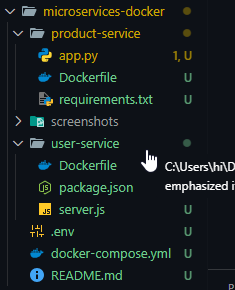

### 2. Docker Build
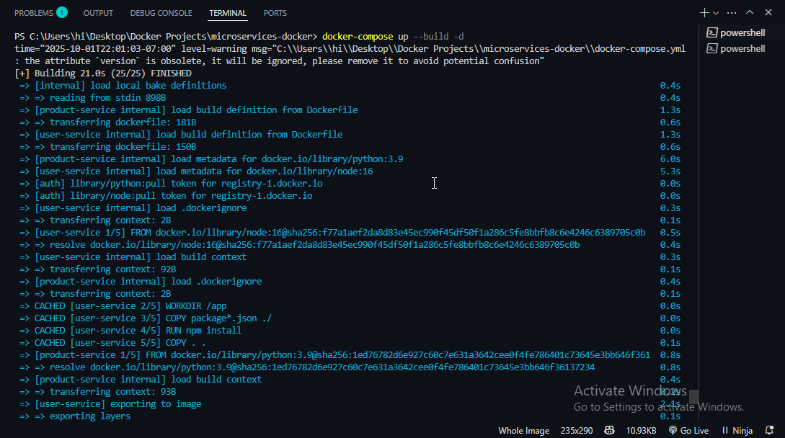

### 3. Running Containers
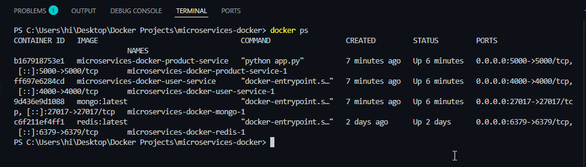

### 4. MongoDb Connection
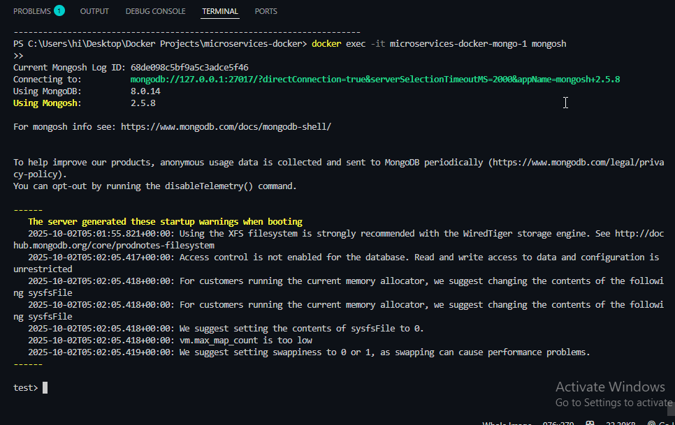

### 5. Redis Running
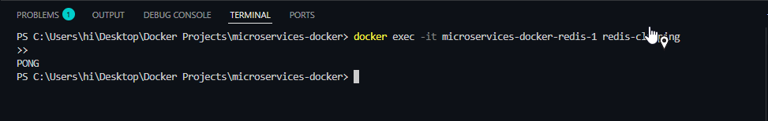

### 6. Docker Desktop
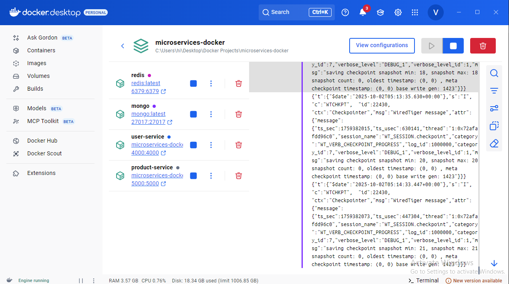

### 7. User Created
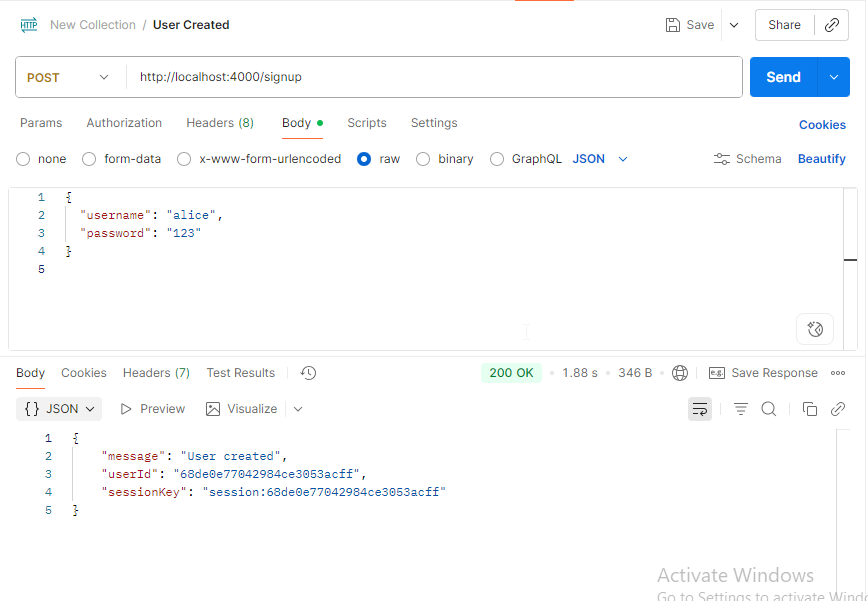

### 8. User Login
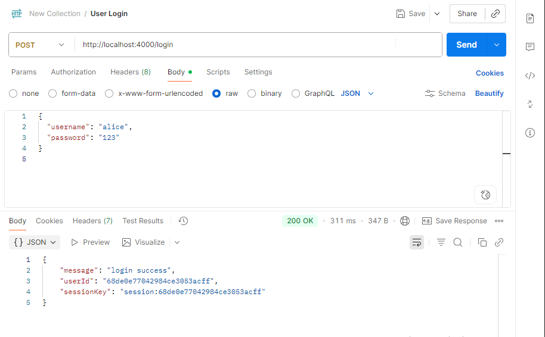

### 9. Session Details
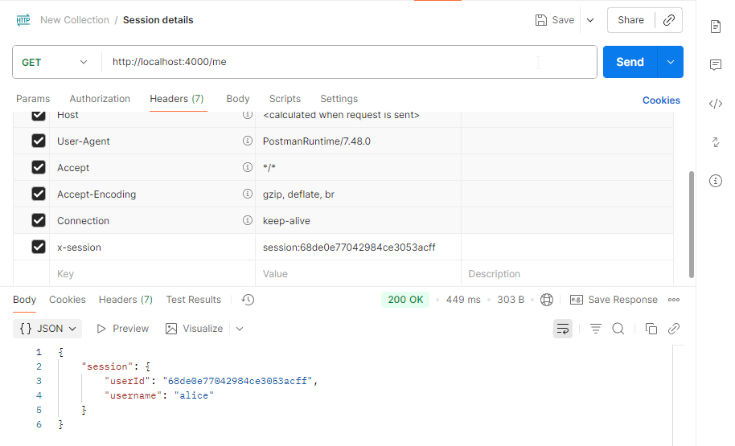

### 10. Add Product
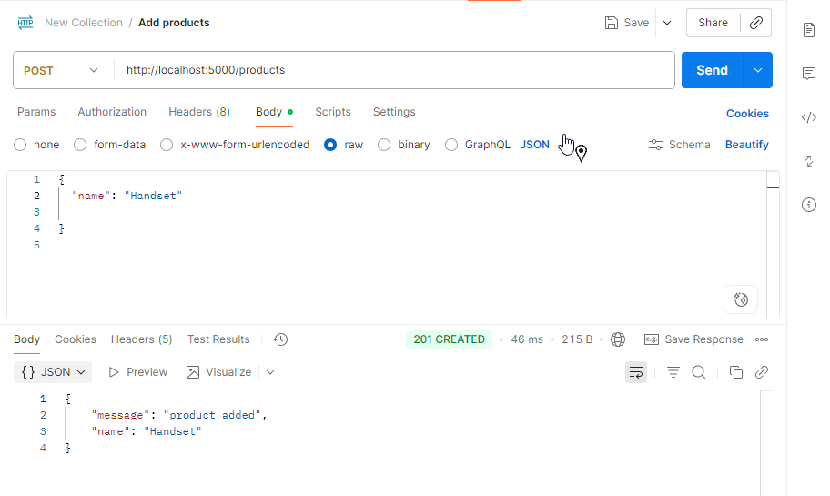

### 11. List Products
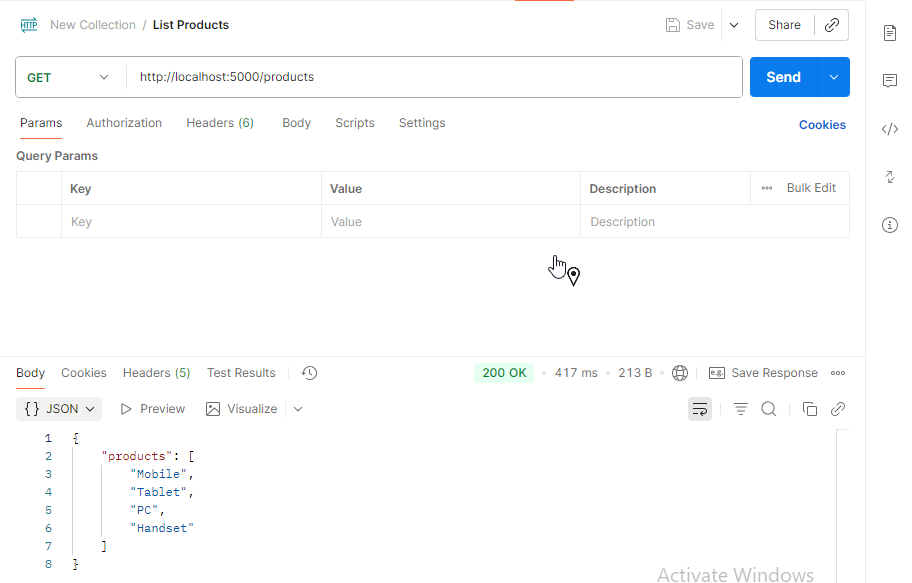

🛠️ Setup Instructions

1️⃣ Clone the repository

    git clone https://github.com/gautamvishal1129-glitch/docker-projects.git
    cd microservices-docker

2️⃣ Copy .env.example → .env and update values if needed

    cp .env.example .env

3️⃣ Build and run containers

    docker compose up -d --build

4️⃣ Access the services

    User Service 👉 http://localhost:4000

    Product Service 👉 http://localhost:5000

5️⃣ Test endpoints using Postman

    Signup: POST http://localhost:4000/signup

    Login: POST http://localhost:4000/login

    Get Products: GET http://localhost:5000/products

    Add Product: POST http://localhost:5000/products

🔧 Useful Docker Commands

    Stop containers:

        docker compose down

    View logs:

        docker compose logs -f

    List volumes:

        docker volume ls