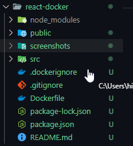
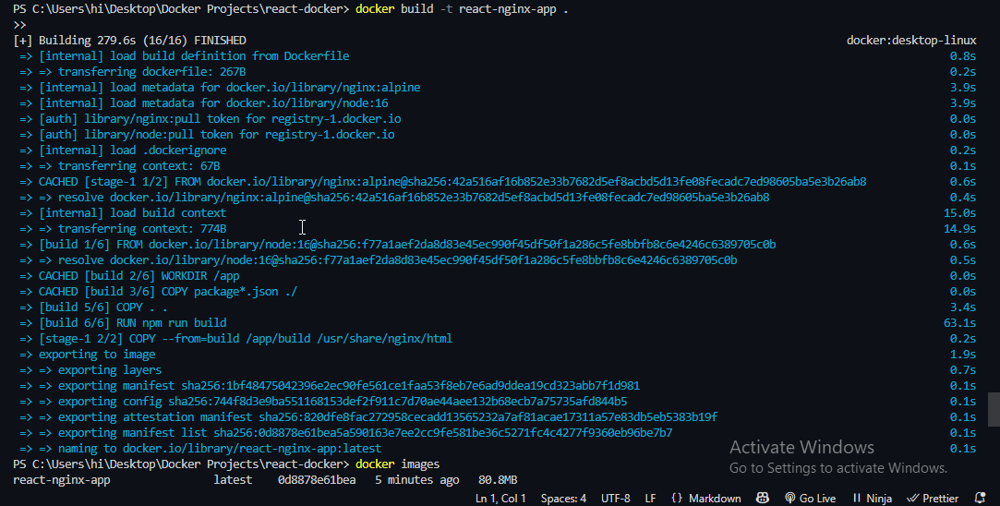
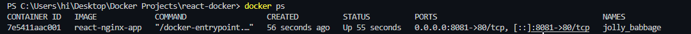
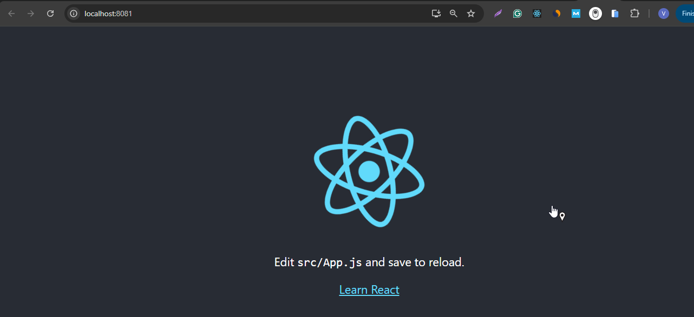
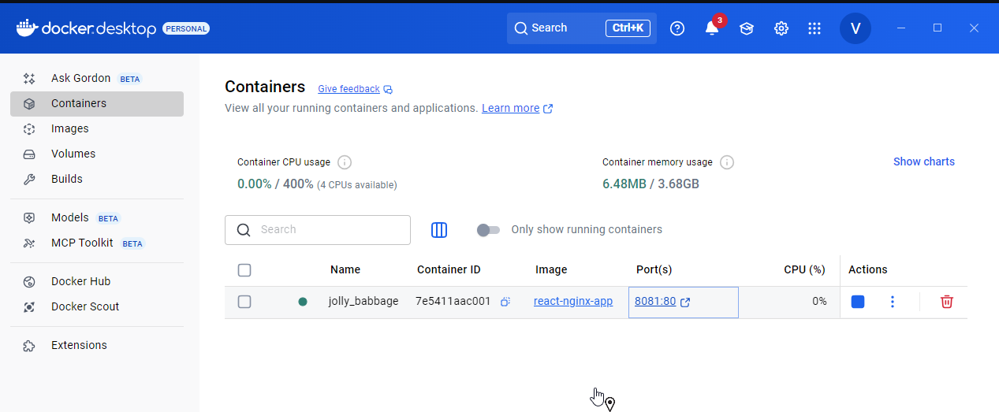

# 🚀 React + Nginx Multi-Stage Docker Project

This project demonstrates how to containerize a **React frontend application** using a **multi-stage Docker build**.  
We use **Node.js** to build the React app and **Nginx** to serve the optimized static files, making the final image lightweight and production-ready.  

---

## ✨ Features
- Multi-stage Docker build (smaller final image size)  
- React app built with Node.js (build stage)  
- Static files served via Nginx (production stage)  
- App runs on **http://localhost:8081**  

---

## 🛠️ Tech Stack
- **Frontend:** React.js  
- **Build Tool:** Node.js  
- **Server:** Nginx  
- **Containerization:** Docker  

---

## 📸 Screenshots

### 1. Project File Structure


### 2. Docker Build


### 3. Running Container


### 4. Browser – React App


### 5. Docker Desktop


---

## 🏗️ How to Build and Run

1. **Clone the repository**  
   ```bash
   git clone https://github.com/gautamvishal1129-glitch/docker-projects.git
   cd docker-projects/react-docker

2. Build the image

    docker build -t react-nginx-app .


3. Run the container

    docker run -d -p 8081:80 react-nginx-app


4. Access the app in browser

    👉 http://localhost:8081

* Stop container

    docker stop <container_id>


* Remove container

    docker rm <container_id>


* View logs

    docker logs -f <container_id>


* List images

    docker images